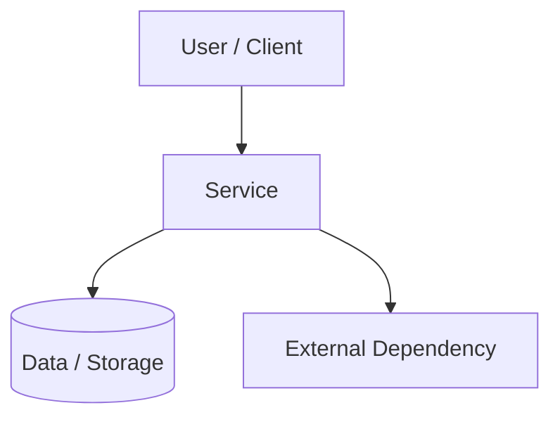
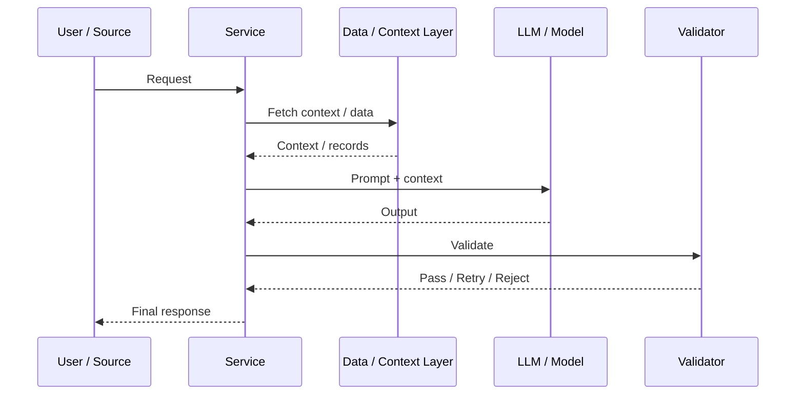

---
tags:
  - template
  - system-design
  - architecture
  - work
  - ml
  - llm
status: draft
date: <% tp.file.creation_date("YYYY-MM-DD") %>
---
# 02 System Design Doc: [Service Name]

**Status:** Draft / In Review / Approved  
**Owner:** [Архитектор]  
**Team Lead:** [Имя]  
**Related Docs:** [01 PRD], [03 ADR], [04 Service Spec], [07 Runbook], [09 Prompt Template]

---

## 1. Executive Summary (Краткое резюме)

> 3-5 предложений: что строим, зачем, каким способом и какие главные ограничения.

### Decision Summary (Сводка решения)

| Field | Value |
| :--- | :--- |
| Decision | [Какое решение строим] |
| Why Now | [Почему сейчас] |
| In Scope | [Что входит] |
| Out of Scope | [Что не входит] |
| Main Trade-off | [Чем платим за решение] |

### Snapshot (Снимок решения)

| Field | Value |
| :--- | :--- |
| Domain | [Support / Sales / Ops / Copilot / Automation] |
| Workload Type | [Online / Async / Batch] |
| Interaction Pattern | [Single-shot / Chain / Agent / HITL] |
| Criticality | [Low / Medium / High] |
| Primary KPI | [Главная метрика] |
| Target Go-Live | [Дата] |

## 2. Context and Scope (Контекст и границы)

- **Business context:** [Контекст]
- **In scope:** [Что входит]
- **Out of scope:** [Что не входит]
- **Assumptions:** [Допущения]

## 3. Requirements Summary (Сводка требований)

- **Functional:** [Ключевые функции]
- **NFR:** [Latency / Security / Availability / Cost]
- **Workload:** [Объем, тип нагрузки, пиковые значения]

## 4. Decision Summary and Main Trade-offs (Сводка решения и ключевые компромиссы)

| Dimension | Choice | Benefit | Cost / Consequence |
| :--- | :--- | :--- | :--- |
| Accuracy vs Latency | [Choice] | [Benefit] | [Cost] |
| Simplicity vs Capability | [Choice] | [Benefit] | [Cost] |
| Build vs Buy | [Choice] | [Benefit] | [Cost] |
| Automation vs Human Review | [Choice] | [Benefit] | [Cost] |

## 5. Workload and Operating Model (Нагрузка и модель эксплуатации)

### 5.1 Input Profile

| Parameter | Value |
| :--- | :--- |
| Source Systems | [CRM / Email / API / Files / Chat] |
| Input Format | [Text / PDF / JSON / Audio / Image] |
| Average Size | [Value] |
| Peak Load | [Value] |
| Seasonality | [Есть / нет] |

### 5.2 Execution Model

- **Mode:** [Realtime / Async / Batch]
- **Trigger:** [API call / Schedule / Event]
- **Concurrency model:** [Queue / workers / parallel fan-out]
- **Retry policy:** [Policy]
- **Idempotency strategy:** [Strategy]
- **Early exit conditions:** [Conditions]

### 5.3 Service Levels

| SLI | SLO | Notes |
| :--- | :--- | :--- |
| Availability | [Target] | |
| End-to-end latency | [Target] | |
| Human review rate | [Target] | |
| Validation pass rate | [Target] | |

## 6. Architecture Overview (Обзор архитектуры)

### 6.1 High-Level Diagram



### 6.2 Components

| Component | Responsibility | Owner |
| :--- | :--- | :--- |
| [Component] | [Role] | [Team / Person] |

### 6.2.1 [Processing Component A] ([Назначение компонента])

[Коротко опишите первый важный внутренний компонент и его роль в общей цепочке обработки.]

**Вход:**

- [Исходный текст сервиса]
- [Формат: Markdown / HTML / plain text / OCR]
- [Дополнительные поля, влияющие на нормализацию]

**Что делает компонент:**

- удаляет или упрощает разметку;
- приводит текст к единому регистру;
- нормализует пробелы, переносы строк и разделители;
- убирает символы, которые не должны влиять на поиск;
- сохраняет исходный текст для трассировки, если это требуется.

**Чего компонент не делает:**

- не исправляет опечатки через LLM, если это не предусмотрено архитектурой;
- не угадывает сущности или намерения;
- не принимает финальное бизнес-решение.

**Выход:**

- [Нормализованный текст]
- [Исходный текст, если нужен для трассировки]
- [Служебная информация о шагах нормализации, если нужна]

**Примеры преобразования или обработки:**

- До:
  `- **[Сущность]** можно использовать в этом сценарии.`
  После:
  `[сущность] можно использовать в этом сценарии`
- До:
  `[Сущность](https://example.com) и [другая сущность]`
  После:
  `[сущность] и [другая сущность]`

**Псевдокод:**

```text
function process_component_a(input_payload):
    working_state = input_payload

    working_state = preprocessing_step_1(working_state)
    working_state = preprocessing_step_2(working_state)
    working_state = preprocessing_step_3(working_state)

    return {
        processed_output: working_state,
        original_input: input_payload
    }
```

### 6.2.2 [Processing Component B] ([Назначение компонента])

[Коротко опишите второй важный внутренний компонент и его роль в общей цепочке обработки.]

**Вход:**

- [Нормализованный текст]
- [Справочник / таблица / словарь для поиска]
- [Правила проверки границ слова, допустимых разделителей или контекста]

**Что делает компонент:**

- проходит по справочнику или набору правил;
- ищет строковые вхождения, регулярные выражения или шаблоны;
- собирает кандидатов для следующего шага;
- удаляет дубликаты и ограничивает результат по контракту.

**Чего компонент не делает:**

- не исправляет опечатки, если это не входит в явную логику;
- не использует LLM, если сервис должен быть детерминированным;
- не принимает финальное решение о бизнес-действии.

**Выход:**

- [Список найденных кандидатов]
- [Найденный фрагмент текста]
- [Ссылка на запись справочника / таблицы]
- [Тип совпадения, если это важно]

**Псевдокод:**

```text
function process_component_b(component_a_output, reference_rows):
    results = []

    for row in reference_rows:
        candidates = build_candidate_values(row)

        for candidate in candidates:
            if match_candidate(candidate, component_a_output):
                results.append({
                    reference_id: row.id,
                    matched_value: candidate,
                    match_type: detect_match_type(candidate, row)
                })
                break

    results = deduplicate_results(results)
    results = apply_contract_limits(results)

    return results
```

Если в сервисе есть отдельный шаг финального сопоставления, ниже можно добавить еще один подраздел, например `6.2.3 [Processing Component C]`, и уже там описать:

- как выбирается итоговый объект или решение;
- что считается валидным или однозначным совпадением;
- когда сервис возвращает результат;
- когда сервис уходит в fallback или альтернативный маршрут.

### 6.3 Key Integrations

| Integration | Protocol | Purpose | Dependency Level |
| :--- | :--- | :--- | :--- |
| [System] | [REST / Queue / SDK] | [Purpose] | [Critical / Important] |

### 6.4 Deployment View

- **Deployment model:** [Cloud / On-prem / Hybrid]
- **Regions / residency:** [Data residency]
- **Environments:** [dev / stage / prod]

## 7. Components and Integrations (Компоненты и интеграции)

### 7.1 Component Criticality

| Component | Role | Criticality | Notes |
| :--- | :--- | :--- | :--- |
| [Component] | [Role] | [Critical / Important / Optional] | [Notes] |

### 7.2 External Interfaces

| Interface | Type | Responsibility | Failure Impact |
| :--- | :--- | :--- | :--- |
| [System / API / Queue] | [Type] | [Why needed] | [Impact] |

## 8. Key System Scenarios (Ключевые системные сценарии)

| Scenario | Trigger | Main Path | Involved Components | Fallback / Exception |
| :--- | :--- | :--- | :--- | :--- |
| [Scenario] | [Trigger] | [Main path] | [Components] | [Fallback] |

## 9. Data Flow (Потоки данных)

### Main Runtime Flow
1. [Step 1]
2. [Step 2]
3. [Step 3]

### Supporting Flows
- [Ingestion / Batch / Feedback / Retraining]

### Main Sequence (Основной сценарий)



## 10. LLM / AI Design (LLM / AI дизайн)

### 10.1 Task Decomposition

| Step | Purpose | Deterministic or AI | Output |
| :--- | :--- | :--- | :--- |
| [Step] | [Purpose] | [AI / Deterministic] | [Output] |

### 10.2 Model Strategy

| Use Case | Primary Model | Fallback Model | Why |
| :--- | :--- | :--- | :--- |
| [Task] | [Model] | [Model] | [Reason] |

### 10.3 Prompting Strategy

- **Prompting approach:** [How prompting is organized]
- **Source hierarchy:** [Priority of sources]
- **Structured output:** [Schema / validation]
- **Human review / clarification:** [When needed]

### 10.4 Confidence and Routing

| Signal | Source | Threshold | Action |
| :--- | :--- | :--- | :--- |
| [Signal] | [Source] | [Threshold] | [Action] |

## 11. Reliability and Degradation (Надежность и деградационные режимы)

- **Fallback behavior:** [Что делаем при проблемах]
- **Failure modes:** [Основные сбои]
- **Recovery path:** [Как восстанавливаемся]
- **Blast radius:** [Что ломается при сбое]
- **Degradation scope:** [Что можно временно отключить]

## 12. Open Questions and Review Notes (Открытые вопросы и заметки ревью)

### Open Questions
- [Question]
- [Question]

### Review Notes
- [Security / QA / Platform / DS review notes]

## 13. Operations Summary (Сводка по эксплуатации)

- **SLO / SLA:** [Target]
- **Observability needs:** [Метрики / логи / алерты]
- **Security considerations:** [PII / vendor / access]
- **Runbooks needed:** [Какие runbooks понадобятся]
