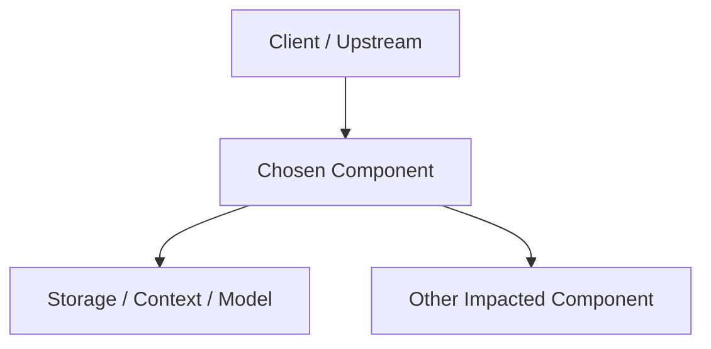

---
tags:
  - template
  - adr
  - architecture
  - work
status: draft
date: <% tp.file.creation_date("YYYY-MM-DD") %>
---
# 03 ADR-[ID]: [Decision Title]

**Status:** Draft / Proposed / Approved / Deprecated  
**Owner:** [Архитектор]  
**Decision Date:** [YYYY-MM-DD]  
**Related Docs:** [02 System Design], [04 Service Spec]

---

## Metadata

| Field | Value |
| :--- | :--- |
| Business Task | [Какую задачу решает это решение] |
| Initiator | [Кто инициировал] |
| Stakeholders | [Кто затронут решением] |
| Key Requirements | [Какие требования/ограничения на решение влияют] |

---

## 1. Context (Контекст)

- [Почему решение понадобилось]
- [Какое ограничение или проблема есть сейчас]
- [Какие требования на это влияют]

### Decision Drivers (Факторы выбора)

- [Что критично для выбора]
- [Какой главный риск нужно снять]
- [Какой компромисс допустим]

## 2. Alternatives Considered (Рассмотренные альтернативы)

### Option A: [Name]
- **Summary:** [Кратко]
- **Pros:** [Плюсы]
- **Cons:** [Минусы]
- **Why not chosen:** [Почему не выбрали]

### Option B: [Name]
- **Summary:** [Кратко]
- **Pros:** [Плюсы]
- **Cons:** [Минусы]
- **Why not chosen:** [Почему не выбрали]

## 3. Decision (Принятое решение)

- **Chosen option:** [Что выбрали]
- **Why:** [Почему]
- **Decision statement:** [Короткая формулировка решения]

### Key Rationale (Ключевая логика выбора)

- [Почему выбранный вариант лучше альтернатив]
- [Какие требования он закрывает лучше всего]
- [Какая слабая сторона у него остается]

## 4. Chosen Architecture Slice (Архитектурный срез выбранного решения)

### High-Level View

### Impacted Components

| Component | What Changes | Why It Matters |
| :--- | :--- | :--- |
| [Component] | [Change] | [Reason] |

### Key Flow

1. [Step 1 of the chosen architecture]
2. [Step 2 of the chosen architecture]
3. [Step 3 of the chosen architecture]

## 5. Consequences (Последствия)

### Positive
- [Что выигрываем]

### Negative / Trade-offs
- [Чем платим]

### Architecture Impact (Влияние на архитектуру)

- [Что меняется в компонентах / потоках / данных]
- [Нужно ли менять contracts / prompts / storage / ops]

## 6. Risks and Mitigations (Риски и митигации)

- [Риски и митигации]

## 7. Links to Impacted Documents (Связанные и затронутые документы)

- [Какой документ нужно обновить]
- [Какой контракт / design / runbook затронут]

## 8. Lifecycle (Жизненный цикл решения)

| Date | Status | Change | Author |
| :--- | :--- | :--- | :--- |
| [Date] | Proposed | [Description] | [Name] |
